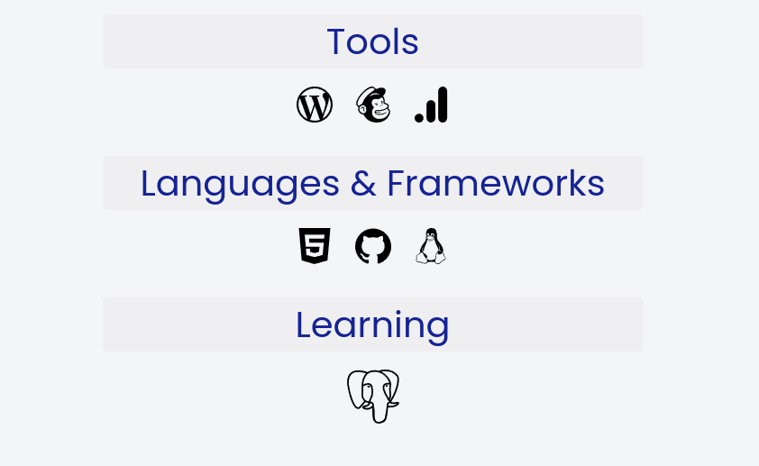

# My Personal Site

This repository is a copy of my [personal homepage](https://www.danielrosehill.com) which I will update periodically.

It's based on the wonderful [Milky Way theme](https://astro.build/themes/details/milky-way/) by [Tristen Tomczak](https://tristentomczak.me/).

That theme can be found on Github [here](https://github.com/ttomczak3/Milky-Way).

My personal website is mostly a place where people find my email address. I use it to link off to other places I'm more active such as my YouTube channel.

To try to make it a bit more visually interesting, I added a liberal smattering of sloth photos (!) and graphics generated with DALLE by OpenAI.

# Thumbnails

(Static version @ 27.06.24)

## Homepage headshot + image

## Modified projects section on homepage, DALLE banner

## Resume / CV section with button

## Resume skills section with SVG buttons

## Contact Page

# Modifications

Some animated CSS classes
Changed theme's color scheme
Modified navbar and removed light/dark mode selector

# Package Additions Vs. Base Theme

## astro-seo

